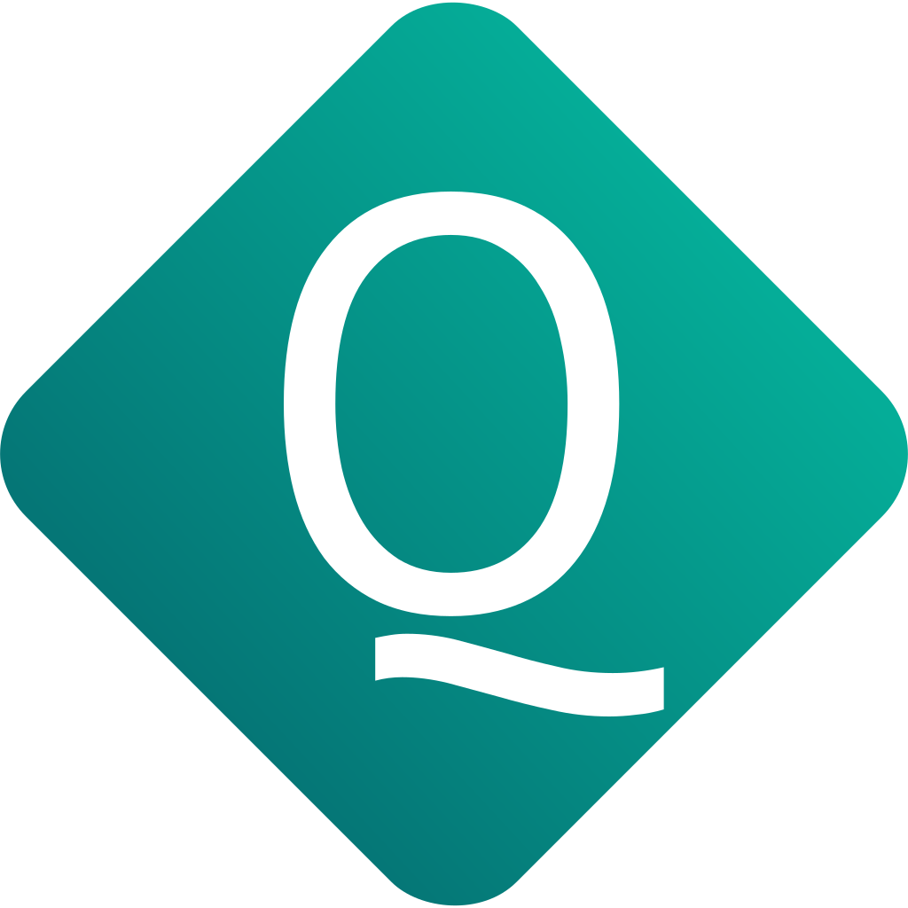

<p align="center"></p>

# QWShortLink

[](https://github.com/bachokviktor/qwshortlink/actions/workflows/tests.yml)

URL Shortener built with Django REST Framework and React

> [!CAUTION]
> We distribute our project under the MIT License, which makes everyone able to freely modify the code and host their own instance of QWShortLink. However, we cannot provide any guarantees about the safety of such self-hosted instances.
>
> The only URL of the original QWShortLink is https://qwsl.click

## Features

- JWT Authentication
- REST API backend
- Swagger docs
- Caching with Redis
- Sending emails and periodic task scheduling with Celery
- Containerization with Docker
- Responsive React frontend
- Support of multiple languages

## Tech Stack

**Backend:** Django, Django REST Framework, simplejwt, drf-spectacular, django-filter

**Frontend:** React, React Router, Axios

**Infrastructure:** PostgreSQL, Redis, Celery, nginx, Docker

**Testing:** pytest

## Quickstart

Clone the repository

``` bash
git clone https://github.com/bachokviktor/qwshortlink.git && cd qwshortlink
```

Set appropriate environmental variables in following files:

- `backend/.env`
- `frontend/.env`
- `db/.env`
- `redis/.env`

Add Redis configuration at `redis/redis.conf`

Build container images

``` bash
docker compose -f docker-compose.dev.yml build
```

Run the containers with Docker Compose

``` bash
docker compose -f docker-compose.dev.yml up
```

Create a superuser

``` bash
docker exec -it qwshortlink-backend python3 manage.py createsuperuser
```

## Testing

Currently, only unit tests for the backend are available

Run unit tests in Docker

``` bash
docker exec -t qwshortlink-backend pytest -v
```

## License

[MIT](https://choosealicense.com/licenses/mit/)
